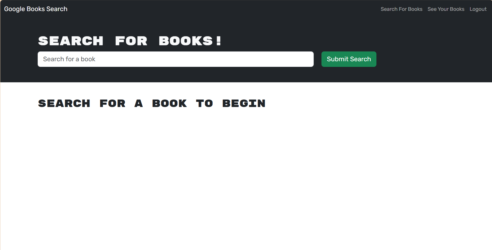

# MERN Challenge: Book Search Engine

## Description

In this project, I refactored a fully functional Google Books API search engine to utilize a modern GraphQL API architecture powered by Apollo Server. The application was built using the MERN stack, featuring a MongoDB database, a React front end, and a Node.js/Express.js server and API. This redesign provides improved query efficiency and flexibility compared to traditional RESTful APIs. The refactored application has been successfully deployed to Render, ensuring a scalable and accessible solution for users to search and manage their book selections.

## Table of Contents

- [Installation](#installation)
- [Usage](#usage)
- [Credits](#credits)
- [License](#license)

## Installation

Use "npm i" to download the Mongoose, Express, React, Jwt-decode, GraphQL, Apollo/server and /client libraries.

## Usage

<a href="https://module-21-challenge-a0nq.onrender.com">Deployed Link</a> 

## Credits

<a href="https://coding-boot-camp.github.io/full-stack/render/deploy-mern-stack-with-render-guide">Deploying a MERN Stack Application to Render</a> 

<a href="https://gist.github.com/lukas-h/2a5d00690736b4c3a7ba">License Page</a> 

## License

